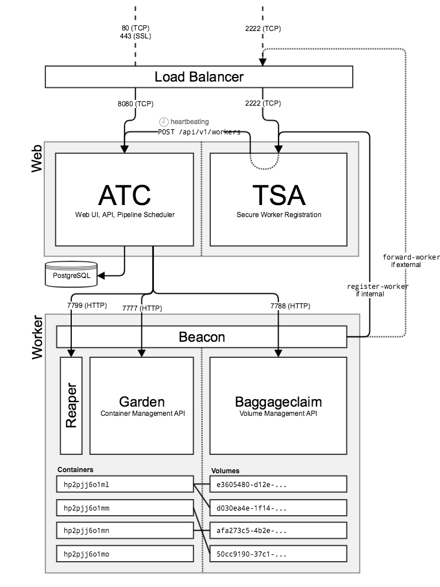

% Concourse - Make CI/CD suck less

# whoami
* Florian Arthofer
* Cloud engineering @ Dynatrace
* @arthfl pretty much everywhere

# What is Concourse?
* "An open-source continuous thing-doer"
* Developed by Pivotal
* Open-Source (Apache License 2.0)
* Yet another CI/CD pipeline?
* Fully(!) container-based
* immutable as fuck

# Why is it nice?
* Everything is a container
* Pipeline config is just simple YAML file
* Configs *must* be commited to be used
* No way to configure things in the web-UI (yes, this is good)
* Easily extendable (if needed)
* Shiny web interface
* Nice CLI

# Pipelines
* A given pipeline is a collection of resources and jobs
* A resource is where you get/put data for/from your job
* A job is where configure at least one task to do something, usually with resources
* A task is where you do your things.

# Resources
* The things where your tasks can get and/or put data
* Typical resources are: git repos, S3 buckets, artifact store... etc
* Every resource has at maximum these functions (all are optional):
    * check - Detects versions in the resource
    * in - Pulls stuff from the resource *in* the pipeline
    * out - Pushes stuff *out* of the pipeilne to re resource

# Jobs
* Consists of 1+n tasks and n resources
* The place where you:
    * Define what task(s) should run
    * Provide configuration for the task(s)
    * Bolt tasks together with resources

# Tasks
* This is where things come together and data is being mangled
* Consists of two things:
    * task-definition
    * thing-to-run
* The definition has the following content:
    * Parameters: Runtime configuration for the task
    * Inputs/Outputs: Needed resources
    * Thing-To-Run: What should run (usually a shell script)

# How does this look from the inside?

# Architecture
{ height=80%}

# How do i use it?

# How do i deploy it?
* For local development and testing: docker-compose
* The easiest option for production: Use the BOSH release
* If you want to do it yourself:
    * put the binaries on some hosts (web, worker(s))
    * have PostgreSQL running somewhere (dedicated or shared)
    * configure via a set of env vars

# Questions?
* ???

# Links
* Concourse: [https://concourse-ci.org](https://concourse-ci.org)
* Nice tutorial: [https://concoursetutorial.com/](https://concoursetutorial.com/)
* Develop a resource: [https://content.pivotal.io/blog/developing-a-custom-concourse-resource](https://content.pivotal.io/blog/developing-a-custom-concourse-resource)
